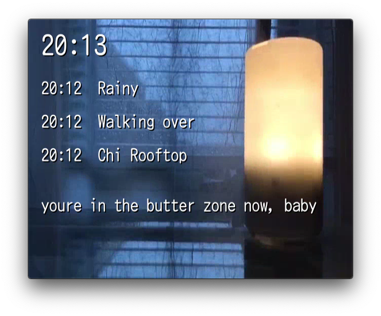

# Comfy Channel

Comfy Channel is a 24/7 live video broadcast with automatic content selection and overlays using [**FFMPEG**](https://ffmpeg.org/) and [**Python**](https://www.python.org/)!



This repository comes with some example content and configurations that can be used to set up Comfy Channel.

## How to run

**Perform the steps outlined in [Requirements](#requirements) first!!!**

The main program is [ComfyChannel.py](/src/ComfyChannel.py). The following is an example command:

```bash
src/ComfyChannel.py -o "rtmp://localhost/live/stream"
```

The full list of arguments is as follows:

```bash
usage: ComfyChannel.py [-h] [-o OUTPUT] [-ua UPNEXT_AUDIO_FILE]
                       [-uv UPNEXT_VIDEO_FILE] [-uw UPNEXT_WISDOM_FILE]
                       [-f FONT_FILE]

optional arguments:
  -h, --help            show this help message and exit
  -o OUTPUT, --output OUTPUT
                        output location (stream url)
  -ua UPNEXT_AUDIO_FILE, --upnext_audio_file UPNEXT_AUDIO_FILE
                        folder for upnext audio files
  -uv UPNEXT_VIDEO_FILE, --upnext_video_file UPNEXT_VIDEO_FILE
                        folder for upnext video files
  -uw UPNEXT_WISDOM_FILE, --upnext_wisdom_file UPNEXT_WISDOM_FILE
                        file for wisdom text
  -f FONT_FILE, --font_file FONT_FILE
                        font file for overlay text
```

## Docker images

To make things easier, I have created two [Docker](https://www.docker.com/) images for quickly setting up [Comfy Channel](https://github.com/mvarhola/comfy-channel). Visit the following repositories for instruction on setting up the images:

**mvarhola/comfy-channel**: <https://github.com/mvarhola/comfy-channel-docker>

**mvarhola/nginx-rtmp**: <https://hub.docker.com/r/mvarhola/nginx-rtmp/>

## Requirements

Comfy Channel requires FFMPEG to be compiled with **libfreetype** and **libfdk_aac**, which are not included in most distributed ffmpeg packages.

For **Mac OS** [**Homebrew**](https://brew.sh/) users, install [**homebrew-ffmpeg**](https://github.com/varenc/homebrew-ffmpeg), which will have the required libraries.
To install ffmpeg with all available libraries, run the following command:

```bash
brew options ffmpeg

brew install ffmpeg \
--with-chromaprint \
--with-fdk-aac \
--with-fontconfig \
--with-freetype \
--with-frei0r \
--with-game-music-emu \
--with-libass \
--with-libbluray \
--with-libbs2b \
--with-libcaca \
--with-libgsm \
--with-libmodplug \
--with-libsoxr \
--with-libssh \
--with-libvidstab \
--with-libvorbis \
--with-libvpx \
--with-opencore-amr \
--with-openh264 \
--with-openjpeg \
--with-openssl \
--with-opus \
--with-rtmpdump \
--with-rubberband \
--with-sdl2 \
--with-snappy \
--with-speex \
--with-tesseract \
--with-theora \
--with-tools \
--with-two-lame \
--with-wavpack \
--with-webp \
--with-x265 \
--with-xz \
--with-zeromq \
--with-zimg
```

There are also modules that need to be installed by Python. To do so, run the follwing command:

```bash
pip install -r src/requirements.txt
```

The **pymediainfo** requires you have the package **mediainfo** installed on your machine (which it is not by default on Ubuntu 18).

## Adding your own files

[**playout.ini**](playout.ini) contains the order of blocks that will be played by Comfy Channel.
A **block** is a section of content that will be played from a single folder.

```ini
[Block1]
name = "Test Block 1"
folder = videos
files = 2
bump_chance = 0.2
```

A **Block** contains the block name, the folder location for the files, the number of files to play, and the chance that a **bump** will be played after each file.

To add a new block, copy and paste one of the example sections and change the name, folder, files, and bump_chance.

## Terminology

**Playout**: a sequence of blocks that Comfy Channel will play in order. The sequence is defined in [**playout.ini**](/playout.ini)

**Block**: a section of content that will be played from a single folder.

**Bump**: a short video selected from the bumps folder that can include a brief announcement. For examples, check out [**[bumpworthy]**](https://www.bumpworthy.com).

**Upnext**: a auto-generated video that gets played in between each **block**. Shows the upcoming videos, what time they will be played, and a short **wisdom** text. The video and audio files of the upnext can be different.

**Wisdom**: Comfy Channel will pick a random line from the [**wisdom file**](/upnext/wisdom.txt) to insert into the **upnext**.

## Inspiration

My main goal for Comfy Channel was to have the little clock in the top left corner like you see on Japanese TV

## Included media

Videos:
[**Various videos that I recorded**](https://www.youtube.com/channel/UCjgBGlfTl5UMvtmH838x99w)

Font:
[**HC Maru Gothic font**](https://www.freejapanesefont.com/hc-maru-gothic-font-download/)

Upnext audio files from:
[**Delroy Edwards - SLOWED DOWN FUNK**](https://www.sloweddownfunk.net/)
